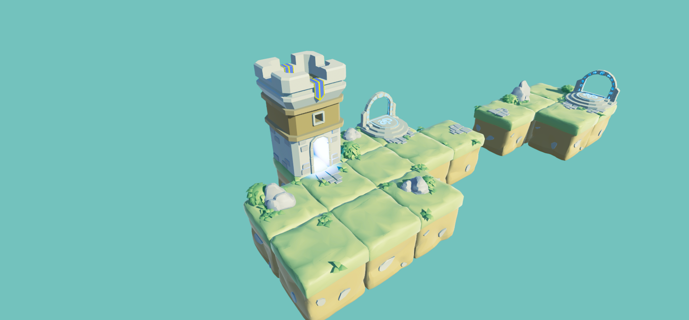

# Formation C# et Unity

<div>
  
  
<div>

Ce dépôt contient tous les projets, et codes source que j'ai réalisés et pris au cours de ma formation sur Udemy concernant le développement avec C# et Unity.

## À propos de la formation

Cette formation Udemy couvre les fondamentaux de la programmation en C# dans le contexte du développement de jeux avec Unity. J'ai ajouter quelques shaders, permettant de créer des effets visuels pour les attaques.
Il y aussi une deuxieme scene que j'ai commencé a realiser avec quellque asset que j'ai fait avec blender. 

### Ce que vous trouverez dans ce dépôt

- **Projets Unity** : Une scenes développés au cours de la formation et une autre realiser plus tard.
- **Scripts C#** : Les scripts utilisés pour animer et contrôler les comportements dans les projets Unity.
- **Shaders** : Une collection de shaders personnalisés créés pour explorer différents effets visuels.

## Comment utiliser ce dépôt

Pour explorer les projets, clonez ce dépôt sur votre machine locale en utilisant :

```bash
git clone https://github.com/votre_nom_utilisateur/votre_repo_formation_csharp_unity.git
```
Il ya deux scenes, une jouable `Jeu_Niveau1` et une seconde `Cube_World` qui le resultat de ce que j'ai realiser avec Blender.

## Prérequis
Unity, de préférence la version utilisée dans la formation ou une version ultérieure.
Connaissance de base en programmation C# est recommandée pour suivre aisément les exemples de code.

## Contrôles

Le jeu intègre un système de contrôle :

- **Déplacement** : Utilisez les touches `ZQSD` pour vous déplacer dans l'environnement de jeu.
- **Saut** : Appuyez sur la touche `Espace` pour sauter. Le saut intègre une assistance de visée (`aim assist`) qui cible automatiquement le monstre le plus proche.
- **Dash** : Maintenez la touche `Shift` pour activer un dash rapide, permettant d'esquiver les attaques ou de vous déplacer rapidement sur de courtes distances.
- **Attaque de base** : Un clic gauche déclenche une attaque de base. Cliquez deux fois pour lancer un combo, et trois fois pour une suite plus puissante. Le quatrième clic réalise une attaque lourde spéciale.
- **Attaque spéciale** : Un clic droit effectue directement l'attaque lourde spéciale sans nécessiter de combo préalable.

